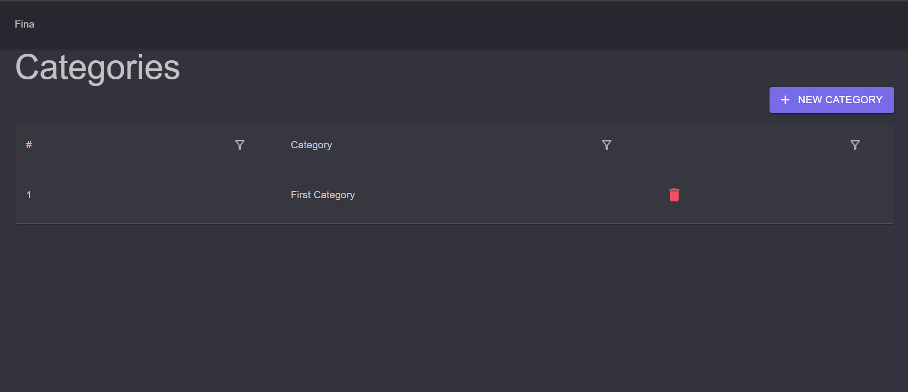
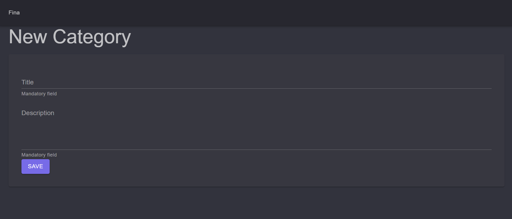
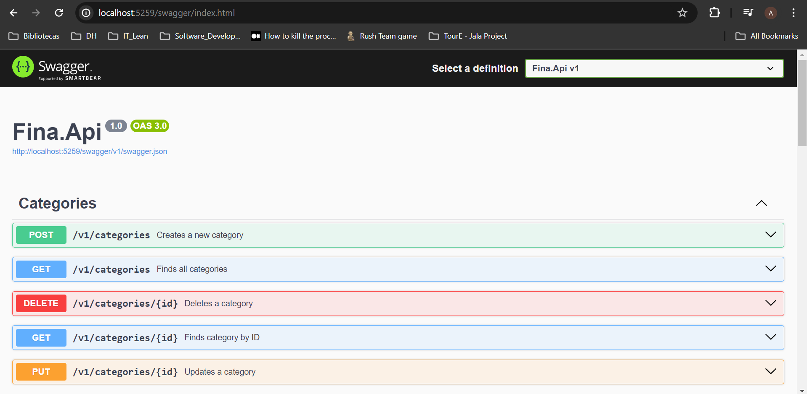

  <h1> Fina </h1>

 

  

 

  

 
<!-- 

  

  -->
<!-- 

  

  -->
 

 <a href="#theproject">The Project</a> •
 <a href="#target">Target</a> •
 <a href="#technologies">Technologies</a> •
 <a href="#route">Route</a> •
 <a href="#howtouse">How to Use</a>

 

<h2> 📓 The Project </h2>

 Fina platform for personal financial control 

<h2> 💡 Target </h2>
Development of a Fina, a personal financial control platform, at Full Stack Journey 2024, by Balta.io

 

<h2> 🛠 Technologies </h2>
The following tools were used in building the project:  

|                       Type                       |           Tools           |            References             |
| :----------------------------------------------: | :-----------------------: | :-------------------------------: |
|                       IDE                        |          VS CODE          |  https://code.visualstudio.com/     |
|         Programming Language (Frontend)          |           BLAZOR          |  https://dotnet.microsoft.com/en-us/apps/aspnet/web-apps/blazor                  |
|      Utility-first CSS Framework (Frontend)      |       TAILWIND CSS        |     https://tailwindcss.com/      |
|    Tool for transforming CSS with JavaScript     |         POST CSS          |       https://postcss.org/                  |
|      Graphic components (Frontend, Mobile)       |        LUCIDE-REACT       |    https://lucide.dev/                  |
| Low-level binary code executed in web (Frontend) |        WEB ASSEMBLY       |     https://webassembly.org/      |
|          Programming Language (Backend)          |           DOTNET          |  https://dotnet.microsoft.com/en-us/                  |
|  Financial Infrastructure for Payment (Backend)  |           STRIPE          |        https://stripe.com/                  |
|    API Documentation & Design Tools (Backend)    |          SWAGGER          |        https://swagger.io/                  |
|                Database (Backend)                |        MSSQL SERVER       | https://www.microsoft.com/en-us/sql-server/sql-server-2022            |
|           .NET ORM (Backend, Database)           |     ENTITY FRAMEWORK      |     https://learn.microsoft.com/en-us/ef/      |
| Open source API development ecosystem (Testing)  |          POSTMAN          |      https://www.postman.com/        |
 

  <h3>Backend | API</h3>
  
  
  
   
  <h3>Testing</h3>
  
   
  <h3>Database</h3>
  
   
  <h3>IDE</h3>
  
   
  <!-- <h3>UX/UI</h3>
  
    -->
  <h3>Frontend</h3>
  
  
   

 

<h2> 🔎 Route </h2>
  <ol>
    <li &nbsp;>Part 1 - Backend, Minimal APIs and Entity Framework 
      <ul &nbsp;>
        <li &nbsp;>Install VS Code (IDE)</li>
        <li>Create a new project folder: mkdir Fina</li>
        <li>Enter the project: cd Fina</li>
        <li>Create a new solution: dotnet new sln</li>
        <li &nbsp;><b>Core project</b>
          <ul>
            <li>Create a new project: dotnet new classlib -o Fina.Core</li>
            <li>Add to solution: dotnet sln add ./Fina.Core</li>
            <li>Enter project: cd Fina.Core</li>
            <!-- Guid uses 128 bits - it could be slower and consumes more resources (not indexed on db) -->
            <li>Create Models, Enums, Request and Responses</li>
            <li>Use Constructors and JsonConstructor, JsonIgnore</li>
            <li>Setup the request handlers (interfaces): Handlers</li>
          </ul>
        </li>
        <li &nbsp;><b>Backend project</b>
          <ul>
            <li>Create a new project: dotnet new web -o Fina.Api</li>
            <li>Add to solution: dotnet sln add ./Fina.Api</li>
            <li>Enter project: cd Fina.Api</li>
            <li>References Core project: dotnet add reference ../Fina.Core</li>
          </ul>
        </li>
        <li &nbsp;><b>Frontend project</b>
          <ul>
            <li>Create a new project: dotnet new blazorwasm -o Fina.Web --pwa</li>
            <!-- Runs only on browser -->
            <li>Add to solution: dotnet sln add ./Fina.Web</li>
            <li>Enter project: cd Fina.Web</li>
            <li>References Core project: dotnet add reference ../Fina.Core</li>
          </ul>
        </li>
        <li>Return to root folder: cd .. </li>
        <li>Delete any files created from building/compiling the project: dotnet clean</li>
        <li>Compile all references: dotnet build</li>
      </ul>
    </li>
     
    <li &nbsp;>Part 2 - Frontend, Blazor, WebAssembly and PWA 
      <ul &nbsp;>
        <li &nbsp;><b>Core project</b>
          <ul>
            <li>Common share folder: Common
              <ol>
                <li>DateTime converter methods</li>
              </ol>
            </li>
            <li>Set url variables: Configuration.cs
              <ol>
                <li>Frontend project: FrontendUrl variable</li>
                <li>Backend project: BackendUrl variable</li>
              </ol>
            </li>
          </ul>
        </li>
        <li &nbsp;><b>Backend project</b>
          <ul>
            <li>Enter backend project: cd Fina.Api</li>
            <li>Add Entity Framework and SQL Server:
              dotnet add package Microsoft.EntityFrameworkCore.SqlServer
            </li>
            <!-- Automatically generates DB (no need create table, drop, etc) -->
            <li>Add Design: dotnet add package Microsoft.EntityFrameworkCore.Design</li>
            <!-- To install EF tools: dotnet tool install ef-tools -->
            <!-- To update EF tools: dotnet tool update --global dotnet-ef -->
            <li>Add documentation packages:
              <ol>
                <li>OpenAPI: dotnet add package Microsoft.AspNetCore.OpenApi</li>
                <li>Swashbuckle (Swagger): dotnet add package Swashbuckle.AspNetCore</li>
              </ol>
            </li>
            <li>Data access
              <ol>Data folder and files
                <li>Mappings: CategoryMapping, TransactionMapping</li>
                <li>Data Context (DB configurations): AppDbContext</li>
              </ol>
            </li>
            <li>Migrations
              <ol>
                <li>Generate: dotnet ef migrations add v1</li>
                <li>Apply to DB: dotnet ef database update</li>
              </ol>
            </li>
            <li>Handlers (Business Logic): CategoryHandler, TransactionHandler</li>
            <li>API settings: ApiConfiguration</li>
            <li>Common folder and files : Common.Api
              <ol>
                <li>Interface: IEndpoint</li>
                <li>Extension methods
                  <ul>
                    <li>AppExtension</li>
                    <li>BuildExtension</li>
                  </ul>
                </li>
              </ol>
            </li>
            <li>Endpoints folder and files
              <ol>
                <li>Categories
                  <ul>
                    <li>Create category: CreateCategoryEndpoint</li>
                    <li>Delete category: DeleteCategoryEndpoint</li>
                    <li>Get category by id: GetCategoryByIdEndpoint</li>
                    <li>Get all categories: GetAllCategoriesEndpoint</li>
                    <li>Update category: UpdateCategoryEndpoint</li>
                  </ul>
                </li>
                <li>Transactions
                  <ul>
                    <li>Create transaction: CreateTransactionEndpoint</li>
                    <li>Delete transaction: DeleteTransactionEndpoint</li>
                    <li>Get transaction by id: GetTransactionByIdEndpoint</li>
                    <li>Get transactions by period: GetTransactionsByPeriodEndpoint</li>
                    <li>Update transaction: UpdateTransactionEndpoint</li>
                  </ul>
                </li>
              </ol>
              <li>Endpoint configurations: Endpoint.cs</li>
            </li>
            <li>Apply Dependency Injection: Program.cs</li>
          </ul>
        </li>
      </ul>
     
    <li &nbsp;>Part 3 - Componentisation, MudBlazor, Publishing 
      <ul &nbsp;> 
        <li &nbsp;><b>Backend project</b>
          <ul>
            <li>Environment variables</li>
            <li>Axios: npm i axios</li>
            <li>JWT: npm i @fastify/jwt</li>
          </ul>
        </li>
        <li &nbsp;><b>Frontend project</b>
          <ul>
            <li>Authentication:</li>
            <li>Set components</li>
          </ul>
        </li>
        <li &nbsp;><b>Core project</b>
          <ul>
            <li>Install Expo-Auth-Session / Expo Crypto: npx expo install expo-auth-session expo-crypto</li>
            <li>Set Github OAuth (Expo)</li>
          </ul>
        </li>
        <li &nbsp;><b>Testing</b>
          <ul>
            <li>Test backend at Hoppscotch: https://hoppscotch.io/</li>
          </ul>
        </li>
      </ul>
    </li>
     
  </ol>

<h2>🧪 How to use</h2>
  <ol &nbsp;>
    <li &nbsp;>Set the development environment at you local computer</li>
    <li &nbsp;>Clone the repository
      <ul>
        <li>git clone https://github.com/alexandrecpedro/financial-control-app</li>
      </ul>
    </li>
    <li &nbsp;>Build the project:
      <ul>
        <li>dotnet build</li>
      </ul>
    </li>
    <li &nbsp;>Run the project:
      <ul>
        <li>dotnet run</li>
      </ul>
    </li>
    <li><b>Testing</b>
      <ul>
        <li &nbsp;><u>Using Swagger documentation</u>
          <ol>
            <li &nbsp;>Enter the directory
              <ul>
                <li>cd Fina.Api</li>
              </ul>
            </li>
            <li &nbsp;>Build the project
              <ul>
                <li>dotnet build</li>
              </ul>
            </li>
            <li &nbsp;>Run
              <ul>
                <li>dotnet run</li>
                <li>Open in Browser: http://localhost:5259/swagger/index.html</li>
              </ul>
            </li>
          </ol>
        </li>
        <li &nbsp;><u>Frontend</u>
          <ol>
            <li &nbsp;>Enter the directory
              <ul>
                <li>cd Fina.Web</li>
              </ul>
            </li>
            <li &nbsp;>Build the project
              <ul>
                <li>dotnet build</li>
              </ul>
            </li>
            <li &nbsp;>Run
              <ul>
                <li>dotnet run</li>
              </ul>
            </li>
          </ol>
        </li>
      </ul>
    </li>
  </ol>

